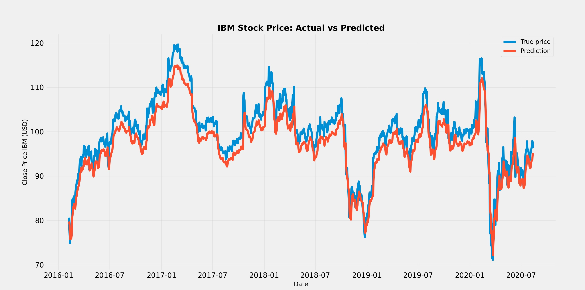

# TradingRobot



Deep learning based trading strategy using TensorFlow and MetaTrader5. This project includes:

- AI-powered stock price prediction using LSTM neural networks (`AI.py`)
- MetaTrader5 trading automation (`Transactions.py`)

## Features

- **AI Stock Prediction**: Uses LSTM neural networks to predict stock prices based on historical data
- **Automated Trading**: Integrates with MetaTrader5 for automated buy/sell operations
- **Data Visualization**: Visualizes predictions and actual prices using matplotlib

## Learnings

- First and foremost, this project was a great exercise in integrating deep learning with real-world applications.
- Gained hands-on experience with LSTM networks for time series prediction.
- Learned to use MetaTrader5's Python API for automated trading.
- However closing dates alone are not sufficient for a robust trading strategy.
- The model ended up lagging behind actual prices, I suspect due to the limited feature set.
- These could include technical indicators, volume data or even sentiment analysis from news sources.

## Requirements

- Python 3.8+
- TensorFlow
- MetaTrader5 account (for trading functionality)
- See `requirements.txt` for full list of dependencies

## Setup

### 1. Clone

Clone this repo to your local machine:

```bash
git clone https://github.com/TomSB1423/TradingRobot.git
cd TradingRobot
```

### 2. Install Dependencies

Install required Python packages:

```bash
pip install -r requirements.txt
```

### 3. Configure Environment Variables

Copy the example environment file and add your MetaTrader5 credentials:

```bash
cp .env.example .env
```

Edit `.env` and add your credentials:

```env
MT5_USERNAME=your_username_here
MT5_PASSWORD=your_password_here
MT5_SERVER=your_server_here
```

## Usage

### AI Stock Prediction

Run the AI model to predict stock prices:

```bash
python src/AI.py
```

This will:

- Fetch historical IBM stock data from Yahoo Finance
- Train an LSTM model on 80% of the data
- Test on remaining 20%
- Display predictions vs actual prices
- Output RMSE (Root Mean Square Error)

### MetaTrader5 Trading

Run the trading bot (requires MetaTrader5 setup):

```bash
python src/Transactions.py
```

This will:

- Connect to your MetaTrader5 account
- Execute buy/sell operations based on the configured strategy
- Display account information and trade results
